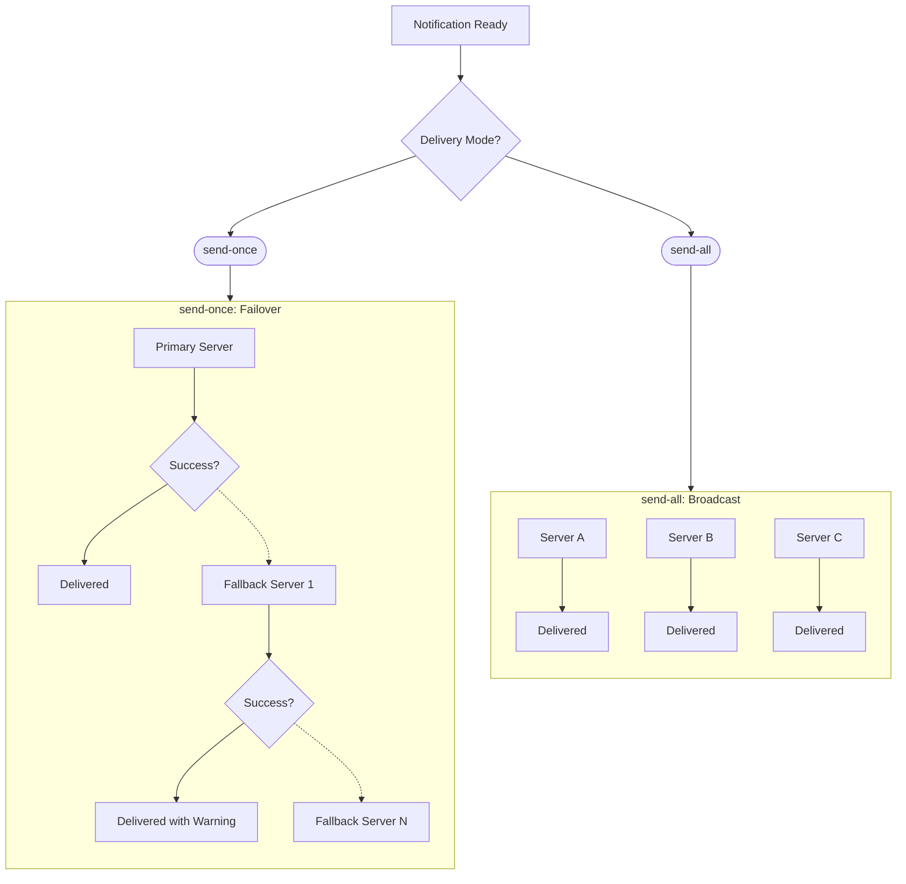

Choose between `send-once` failover and `send-all` broadcast to control how notifications reach your ntfy servers.



## send-once

Tries the primary server first. If it fails (network error, non-2xx response), the next server in the list is tried.

This continues until one server succeeds or all have been exhausted. When a fallback server delivers the notification, a warning is prepended to the message body.

The prepended warning uses this format:

```
⚠️ Primary server "primary" was unreachable. This notification was delivered via "secondary".
```

The server names in the warning match the names from your config, not fixed labels.

Best for:

- **Redundancy setups** — You want notifications delivered reliably, but only once.
- **Multiple ntfy instances** — A primary NAS server with a cloud backup.

## send-all

Sends the notification to every server in the context's `servers` list simultaneously. All servers receive the same notification in parallel.

Best for:

- **Synchronized instances** — You want the same notification on multiple devices or servers.
- **Multi-site deployments** — Each site runs its own ntfy server and should receive all notifications.

## Server Failover

In `send-once` mode, failover is automatic and ordered:

1. The `primary_server` is tried first.
2. If it fails, the remaining servers from the `servers` list (excluding the primary) are tried in order.
3. This continues until one succeeds or all fail.

The response indicates whether a fallback was used and which servers succeeded or failed. In `send-all` mode, there is no failover — every server is contacted regardless of individual failures.

## IP Forwarding

The proxy sets the `X-Forwarded-For` header on outgoing requests to ntfy servers using the original client IP from Cloudflare's `cf-connecting-ip` header. This means your ntfy server sees the real client IP, not the Cloudflare edge IP. This applies to all delivery modes.

## ntfy Headers

The proxy sets these ntfy headers on outgoing requests based on the interpreter's notification output. Interpreters transform the incoming payload and return a notification object, and the format stage maps those fields to headers.

| Header       | Notification Field | Description                                                                         |
|--------------|--------------------|-------------------------------------------------------------------------------------|
| `X-Title`    | `title`            | Message title displayed prominently in the notification.                            |
| `X-Priority` | `priority`         | Priority level from 1 (min) to 5 (max). Controls alert urgency and phone vibration. |
| `X-Tags`     | `tags`             | Comma-separated tags. Emoji shortcodes (e.g., `warning`) render as icons.           |
| `X-Markdown` | `markdown`         | Set to `true` to enable Markdown rendering in the message body.                     |
| `X-Icon`     | `icon`             | URL of a custom notification icon.                                                  |
| `X-Actions`  | `actions`          | Action buttons (view URL, broadcast, HTTP request).                                 |
| `X-Attach`   | `attach`           | URL of a file to download and attach to the notification.                           |
| `X-Filename` | `filename`         | Filename for an attachment sent as binary in the request body.                      |

:::info
The `ntfy-json` interpreter supports all of these fields directly from the JSON payload. Other interpreters (like `synology`, `seerr`, `statuspage`) set a subset automatically based on the parsed content.
:::

:::warning
The proxy builds outgoing headers from the interpreter's notification object. Incoming request headers — including ntfy-specific ones like `X-Click`, `X-Delay`, `X-Email`, `X-Call`, and `X-Template` — are **not forwarded** to ntfy servers. Only the 8 headers listed above are set. For the full list of ntfy-supported headers, see the [ntfy publishing docs](https://docs.ntfy.sh/publish/).
:::

If no interpreter sets a title, the proxy falls back to the context's `name` field. For full documentation on ntfy headers, see the [ntfy publishing docs](https://docs.ntfy.sh/publish/).

## Attachments

When the notification includes a binary attachment (e.g., an image), delivery happens in two stages per server:

1. **Stage 1** — POST the text message body with ntfy headers.
2. **Stage 2** — PUT the binary attachment with the `X-Filename` header.

If `show_visitor_info` is enabled, visitor details (IP, location, ISP) are appended to the notification body text — they are not sent as a separate message. When the request also includes a binary attachment, the proxy sends two requests per server: a POST with the text body (which includes visitor info) and a PUT with the binary attachment.

### Attachment Message Count

The number of messages you receive depends on your settings and delivery mode. For example, if you send one attachment with `show_visitor_info` enabled, `mode` set to `send-all`, and two ntfy servers configured, you will receive four messages total:

- 1st request: Notification text with visitor info appended (one per server, so 2 messages)
- 2nd request: Binary attachment (one per server, so 2 messages)

:::info
Customizations made via headers are not applied to the attachment message. This prevents duplicate high-priority vibrations (from `X-Priority: 5`) on the attachment message.
:::

## Smart Message Splitting

Messages exceeding 4000 UTF-8 bytes are automatically split into numbered parts. Each part gets a title suffix indicating its position (e.g., "(1/3)", "(2/3)", "(3/3)").

Splitting respects UTF-8 character boundaries so multi-byte characters are never broken mid-sequence. The split threshold aligns with ntfy's recommended message size limits.

## Response Format

The worker returns a JSON response after delivery. The default response includes only the status:

```json
{
  "status": "success"
}
```

If a fallback server was used, a `fallback_note` field is included:

```json
{
  "status": "success",
  "fallback_note": "Delivered via fallback server \"secondary\""
}
```

When `show_response_output` is enabled, the response includes full details:

```json
{
  "status": "success",
  "context": "GitHub Status",
  "interpreter": "statuspage",
  "servers": [
    { "name": "primary", "success": true, "status": 200, "stages": ["stage-1: ok"] }
  ],
  "message": {
    "title": "[GitHub] Elevated Error Rates",
    "body_size": 342,
    "parts": 1,
    "has_attachment": false
  }
}
```

Possible status values:

- `"success"` — All servers returned 2xx. HTTP status is 200.
- `"partial"` — Some servers succeeded, some failed. HTTP status is 200.
- `"failed"` — All servers failed. HTTP status is 502.
- `"error"` — A pipeline error occurred (authentication, routing, interpretation, etc.). HTTP status varies: 400, 403, 404, 405, 422, or 500.
- `"ignored"` — The interpreter intentionally suppressed the notification (returned `null`). HTTP status is 200.
