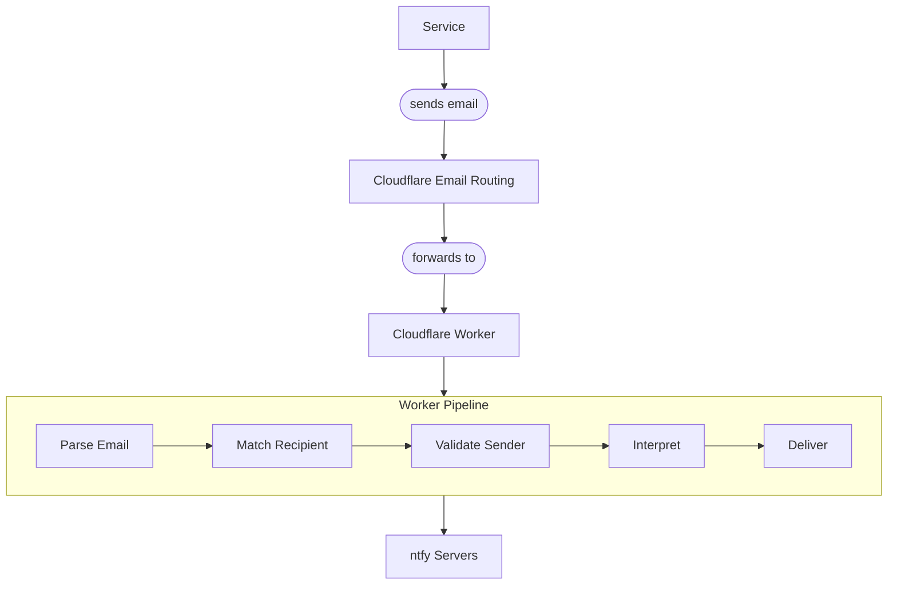

Convert incoming emails into ntfy push notifications using Cloudflare Email Routing.



## How It Works

1. A service sends an email to `{context-id}@{base_domain}` (e.g., `pfsense@ntfy.example.com`).
2. Cloudflare Email Routing forwards the email to the worker.
3. The worker parses the raw RFC 5322 email message, extracting the from address, to address, subject, and text body.
4. The recipient's local part (before the `@`) is matched to a context by `id`.
5. The sender is validated against the context's `allowed_from` field (if configured).
6. The configured interpreter transforms the email content into a notification.
7. The notification is delivered to ntfy servers following the context's delivery mode.

:::info
Email contexts work alongside HTTP contexts in the same deployment. Each email context gets a dedicated email address based on its context `id` and the worker's domain.
:::

## Cloudflare Email Routing Setup

The `deploy` command automatically configures Cloudflare Email Routing rules for your email contexts. For each email context, it creates a routing rule that forwards `{context-id}@{base_domain}` to your worker.

If you prefer to set this up manually, or if automatic setup fails:

1. In the Cloudflare dashboard, go to **Email** > **Email Routing**.
2. Enable Email Routing for your domain.
3. For each email context, add a routing rule:
   - **Custom address**: `{context-id}@{base_domain}`
   - **Destination**: Your worker (select "Send to a Worker")

:::tip
The `generate` command also outputs comments in `wrangler.toml` showing which email addresses need routing rules. Cloudflare Email Routing is available on the free plan at no additional cost.
:::

## Email Context Configuration

Email contexts use `"type": "email"` and have an `allowed_from` field instead of a `token`:

```json
{
  "id": "pfsense",
  "name": "pfSense Firewall",
  "type": "email",
  "interpreter": "pfsense",
  "topic": "firewall",
  "mode": "send-once",
  "show_visitor_info": false,
  "primary_server": "primary",
  "servers": ["primary"],
  "allowed_from": "*@pfsense.local"
}
```

The `id` field is especially important for email contexts — it determines the email address (`pfsense@ntfy.example.com` in this example).

## Sender Authentication

The `allowed_from` field controls which senders can trigger the context:

- **Exact match** — `user@example.com` allows only that specific address.
- **Wildcard** — `*@example.com` allows any sender from that domain.
- **Not set** — All senders are allowed if the field is omitted.

Matching is case-insensitive. Unauthorized emails produce no reply to the sender, but if the context has an `error_topic`, an error notification is sent there.

## Email Parsing

The worker parses MIME-encoded emails:

- **Multipart messages** — Prefers `text/plain` parts over HTML. Falls back to stripped HTML if no plain text is available.
- **Headers** — Extracts from, to, and subject after unfolding continuation lines.
- **Nested boundaries** — Handles multi-level multipart structures.

Interpreters designed for email (like `pfsense` and `unifi`) receive an object with `subject`, `textBody`, `from`, and `to` fields.

## Supported Email Interpreters

These interpreters are designed for email payloads:

- **[pfSense](/docs/interpreters/pfsense/)** — Parses pfSense notification emails. Extracts hostname from subject, infers priority from keywords (gateway down, errors, warnings).
- **[UniFi](/docs/interpreters/unifi/)** — Parses UniFi Network notification emails. Extracts alert type, device name, and device URL.

## Limitations

- **No reply** — Email processing is one-way. The worker does not send confirmation or error replies.
- **Silent failures** — Unlike HTTP contexts (which return HTTP error responses), email failures produce no reply to the sender. If the context has an `error_topic` configured, authentication and interpretation errors are forwarded there as debug attachments.
- **Message size** — Cloudflare Email Routing does not support messages larger than 25 MiB.
- **Rule limit** — A maximum of 200 email routing rules can be configured per zone.
