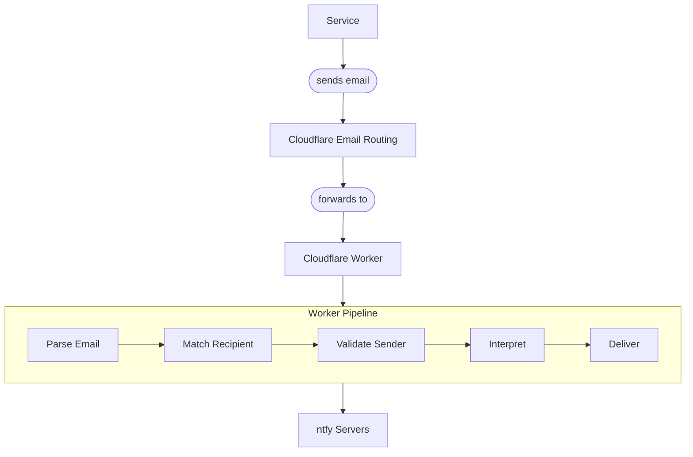

import { Terminology } from '@cbnventures/docusaurus-preset-nova/blocks';

Convert incoming emails into ntfy push notifications using <Terminology title="Cloudflare feature that forwards email to the Worker" to="/docs/reference/terminology#cloudflare-email-routing">Cloudflare Email Routing</Terminology>.


```mermaid
flowchart TD
    Service[Service] --> SendEmail(["sends email"]):::muted --> CF[Cloudflare Email Routing]
    CF --> Forward(["forwards to"]):::muted --> Worker[Cloudflare Worker]

    subgraph Pipeline [Worker Pipeline]
        direction LR
        ParseEmail[Parse Email] --> Route[Match Recipient]
        Route --> Auth[Validate Sender]
        Auth --> Interpret[Interpret]
        Interpret --> Deliver[Deliver]
    end

    Worker --> Pipeline
    Pipeline --> ntfy[ntfy Servers]
```

## How It Works

1. A service sends an email to `{context-id}@{base_domain}` (e.g., `pfsense@ntfy.example.com`).
2. <Terminology title="Cloudflare feature that forwards email to the Worker" to="/docs/reference/terminology#cloudflare-email-routing">Cloudflare Email Routing</Terminology> forwards the email to the <Terminology title="Cloudflare-hosted entry point that runs the pipeline" to="/docs/reference/terminology#worker">worker</Terminology>.
3. The <Terminology title="Cloudflare-hosted entry point that runs the pipeline" to="/docs/reference/terminology#worker">worker</Terminology> parses the raw RFC 5322 email message, extracting the from address, to address, subject, and text body.
4. The recipient's local part (before the `@`) is matched to a <Terminology title="a notification source configuration" to="/docs/reference/terminology#context">context</Terminology> by `id`.
5. The sender is validated against the <Terminology title="a notification source configuration" to="/docs/reference/terminology#context">context</Terminology>'s `allowed_from` field (if configured).
6. The configured <Terminology title="module that transforms a payload into a notification" to="/docs/reference/terminology#interpreter">interpreter</Terminology> transforms the email content into a notification.
7. The notification is delivered to ntfy <Terminology title="an ntfy instance defined by name, URL, and token" to="/docs/reference/terminology#server">servers</Terminology> following the <Terminology title="a notification source configuration" to="/docs/reference/terminology#context">context</Terminology>'s delivery mode.

:::info
Email <Terminology title="a notification source configuration" to="/docs/reference/terminology#context">contexts</Terminology> work alongside HTTP <Terminology title="a notification source configuration" to="/docs/reference/terminology#context">contexts</Terminology> in the same deployment. Each email <Terminology title="a notification source configuration" to="/docs/reference/terminology#context">context</Terminology> gets a dedicated email address based on its <Terminology title="a notification source configuration" to="/docs/reference/terminology#context">context</Terminology> `id` and the <Terminology title="Cloudflare-hosted entry point that runs the pipeline" to="/docs/reference/terminology#worker">worker</Terminology>'s domain.
:::

## Cloudflare Email Routing Setup

The `deploy` command automatically configures <Terminology title="Cloudflare feature that forwards email to the Worker" to="/docs/reference/terminology#cloudflare-email-routing">Cloudflare Email Routing</Terminology> rules for your email <Terminology title="a notification source configuration" to="/docs/reference/terminology#context">contexts</Terminology>. For each email <Terminology title="a notification source configuration" to="/docs/reference/terminology#context">context</Terminology>, it creates a routing rule that forwards `{context-id}@{base_domain}` to your <Terminology title="Cloudflare-hosted entry point that runs the pipeline" to="/docs/reference/terminology#worker">worker</Terminology>.

If you prefer to set this up manually, or if automatic setup fails:

1. In the Cloudflare dashboard, go to **Email** > **Email Routing**.
2. Enable Email Routing for your domain.
3. For each email <Terminology title="a notification source configuration" to="/docs/reference/terminology#context">context</Terminology>, add a routing rule:
   - **Custom address**: `{context-id}@{base_domain}`
   - **Destination**: Your <Terminology title="Cloudflare-hosted entry point that runs the pipeline" to="/docs/reference/terminology#worker">Worker</Terminology> (select "Send to a Worker")

:::tip
The `generate` command also outputs comments in `wrangler.toml` showing which email addresses need routing rules. <Terminology title="Cloudflare feature that forwards email to the Worker" to="/docs/reference/terminology#cloudflare-email-routing">Cloudflare Email Routing</Terminology> is available on the free plan at no additional cost.
:::

## Email Context Configuration

Email <Terminology title="a notification source configuration" to="/docs/reference/terminology#context">contexts</Terminology> use `"type": "email"` and have an `allowed_from` field instead of a `token`:

```json
{
  "id": "pfsense",
  "name": "pfSense Firewall",
  "type": "email",
  "interpreter": "pfsense",
  "topic": "firewall",
  "mode": "send-once",
  "show_visitor_info": false,
  "primary_server": "primary",
  "servers": ["primary"],
  "allowed_from": "*@pfsense.local"
}
```

The `id` field is especially important for email <Terminology title="a notification source configuration" to="/docs/reference/terminology#context">contexts</Terminology> — it determines the email address (`pfsense@ntfy.example.com` in this example).

## Sender Authentication

The `allowed_from` field controls which senders can trigger the <Terminology title="a notification source configuration" to="/docs/reference/terminology#context">context</Terminology>:

- **Exact match** — `user@example.com` allows only that specific address.
- **Wildcard** — `*@example.com` allows any sender from that domain.
- **Not set** — All senders are allowed if the field is omitted.

Matching is case-insensitive. Unauthorized emails produce no reply to the sender, but if the <Terminology title="a notification source configuration" to="/docs/reference/terminology#context">context</Terminology> has an `error_topic`, an error notification is sent there (subject to the `error_events` filter if configured).

## Email Parsing

The <Terminology title="Cloudflare-hosted entry point that runs the pipeline" to="/docs/reference/terminology#worker">worker</Terminology> parses MIME-encoded emails:

- **Multipart messages** — Prefers `text/plain` parts over HTML. Falls back to stripped HTML if no plain text is available.
- **Headers** — Extracts from, to, and subject after unfolding continuation lines.
- **Nested boundaries** — Handles multi-level multipart structures.

<Terminology title="module that transforms a payload into a notification" to="/docs/reference/terminology#interpreter">Interpreters</Terminology> designed for email (like `pfsense` and `unifi`) receive an object with `subject`, `textBody`, `from`, and `to` fields.

## Supported Email Interpreters

These <Terminology title="module that transforms a payload into a notification" to="/docs/reference/terminology#interpreter">interpreters</Terminology> are designed for email payloads:

- **[pfSense](/docs/interpreters/pfsense/)** — Parses pfSense notification emails. Extracts hostname from subject, infers priority from keywords (gateway down, errors, warnings).
- **[UniFi](/docs/interpreters/unifi/)** — Parses UniFi Network notification emails. Extracts alert type, device name, and device URL.

## Limitations

- **No reply** — Email processing is one-way. The <Terminology title="Cloudflare-hosted entry point that runs the pipeline" to="/docs/reference/terminology#worker">worker</Terminology> does not send confirmation or error replies.
- **Silent failures** — Unlike HTTP <Terminology title="a notification source configuration" to="/docs/reference/terminology#context">contexts</Terminology> (which return HTTP error responses), email failures produce no reply to the sender. If the <Terminology title="a notification source configuration" to="/docs/reference/terminology#context">context</Terminology> has an `error_topic` configured, authentication and interpretation errors are forwarded there as debug <Terminology title="a binary file delivered alongside a notification" to="/docs/reference/terminology#attachment">attachments</Terminology> (subject to the `error_events` filter if configured).
- **Message size** — <Terminology title="Cloudflare feature that forwards email to the Worker" to="/docs/reference/terminology#cloudflare-email-routing">Cloudflare Email Routing</Terminology> does not support messages larger than 25 MiB.
- **Rule limit** — A maximum of 200 email routing rules can be configured per zone.
