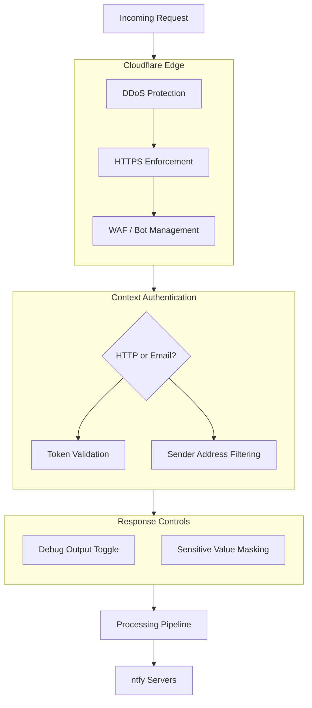

Protect your notification pipeline with context-level authentication, sensitive value masking, and Cloudflare edge security.



## HTTP Authentication

Each HTTP context can optionally require a token. When the `token` field is set on a context, incoming requests must include a matching `Authorization` header.

Supported header formats:

- `Authorization: Bearer {token}` — The standard bearer token format. The `Bearer` prefix is case-sensitive (lowercase `bearer` will not match).
- `Authorization: {token}` — A raw token without the `Bearer` prefix.

If the context has no `token` field, all requests are allowed without authentication.

:::danger
On authentication failure, the worker returns HTTP 403. If the context has an `error_topic` configured, an `error-debug.json` attachment is sent to that topic containing the timestamp, error type, context name, interpreter, and request details (method, URL, headers with the Authorization header stripped, and Cloudflare properties).
:::

<details>
<summary>Example error-debug.json (HTTP authentication)</summary>

```json
{
  "timestamp": "2026-04-15T12:00:00.000Z",
  "error": {
    "type": "authentication",
    "message": "Token mismatch"
  },
  "context": {
    "name": "My Service",
    "interpreter": "plain-text"
  },
  "request": {
    "method": "POST",
    "url": "https://myservice.ntfy.example.com/",
    "headers": {
      "content-type": "text/plain",
      "user-agent": "curl/8.0"
    },
    "cf": {
      "country": "US",
      "colo": "SJC"
    }
  }
}
```

The `Authorization` header is stripped before sending. Interpretation errors include an additional `body` field with `type` and `json` or `text` sub-fields.

</details>

## Email Authentication

Email contexts use the `allowed_from` field to control which senders can trigger notifications.

- **Exact match** — `user@example.com` allows only that address.
- **Wildcard** — `*@example.com` allows any sender from that domain.
- **Not set** — All senders are allowed.

Matching is case-insensitive. If the context has an `error_topic` configured, unauthorized emails send an `error-debug.json` attachment to that topic.

<details>
<summary>Example error-debug.json (email authentication)</summary>

```json
{
  "timestamp": "2026-04-15T12:00:00.000Z",
  "error": {
    "type": "authentication",
    "message": "Sender not in allowed_from"
  },
  "context": {
    "name": "pfSense Alerts",
    "interpreter": "pfsense"
  },
  "email": {
    "from": "unknown@example.com",
    "to": "pfsense@ntfy.example.com",
    "subject": "Alert notification"
  }
}
```

Email interpretation errors include an additional `textBody` field inside the `email` object.

</details>

## Sensitive Value Masking

The worker masks sensitive values in the landing page debug section when `show_response_output` is enabled.

- **Server tokens** — Replaced with `***`.
- **Server URLs** — Replaced with `***`.
- **Base domain** — Replaced with `***`.
- **Context IDs and topics** — Replaced with `***`.
- **Context tokens and `allowed_from`** — Replaced with `***` when present.
- **Error topics** — Replaced with `***` when present.

This masking applies to the collapsible debug section on the GET landing page. The POST/PUT JSON response includes context name, interpreter, and server results only when `show_response_output` is enabled.

## Debug Output

The `show_response_output` setting controls whether detailed information is included in responses.

- **Enabled** — POST/PUT responses include context name, interpreter, per-server delivery results, and message details. The GET landing page shows a collapsible debug section with the masked config. Useful during initial setup.
- **Disabled** — POST/PUT responses include only the delivery status. The GET landing page shows only the operational badge. Recommended for production.

Visiting any context URL in a browser (GET request) shows a landing page instead of processing a notification. When `show_response_output` is enabled, the landing page includes a collapsible section with the full configuration, with sensitive values masked. When disabled, it shows only an operational status badge.

## Cloudflare Edge Protection

Running on Cloudflare Workers provides several security benefits at the edge.

- **Origin IP shielding** — Your ntfy server IPs are never exposed to webhook senders.
- **HTTPS enforcement** — HTTP requests are automatically redirected to HTTPS via 301 (except on localhost for local development).
- **DDoS protection** — Cloudflare's built-in DDoS mitigation applies to all traffic.

## WAF Configuration

Cloudflare's bot protection can block legitimate webhooks. You may need to adjust these settings.

1. **Bot Fight Mode** (free plan) — Disable this in **Dashboard > Security > Bots** if automated requests are being blocked with 403 responses. Bot Fight Mode cannot be bypassed with WAF rules.
2. **WAF skip rule** (Pro+) — Pro plans and above use Super Bot Fight Mode, which can be skipped. Create a custom rule that skips Super Bot Fight Mode for your proxy's hostnames:
   - If: `(http.host contains "ntfy.example.com" and not http.request.headers["sec-fetch-mode"] eq "navigate")`
   - Then: Skip all Super Bot Fight Mode rules.
3. **Configuration rule** — Set a custom filter to match your proxy hostnames, disable Browser Integrity Check, and set Security Level to "Essentially Off".

:::warning
Bot Fight Mode cannot be skipped via WAF rules on any plan. The skip rule above targets Super Bot Fight Mode, which is available on Pro plans and above. Free plan users will need to disable Bot Fight Mode entirely if it blocks webhook traffic.
:::

## HTTPS Enforcement

The worker automatically redirects HTTP requests to HTTPS using a 301 redirect. This applies to all requests where the hostname includes the configured `base_domain`, except those on `localhost` (for local development with `wrangler dev`).

## Best Practices

- Set a unique `token` on each HTTP context that receives traffic from the public internet.
- Use `allowed_from` wildcards on email contexts to restrict senders to expected domains.
- Disable `show_response_output` in production to minimize information exposure.
- Disable `show_visitor_info` unless you need IP and location details in notifications.
- On Pro plans and above, set up a Super Bot Fight Mode skip rule rather than disabling bot protection entirely.
- Use `error_topic` only with ntfy servers you control — error notifications include full context details, request metadata, and email content as unmasked JSON attachments.
