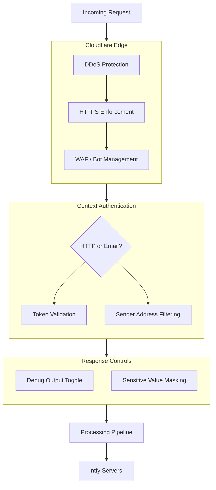

import { Terminology } from '@cbnventures/docusaurus-preset-nova/blocks';

Protect your notification <Terminology title="ordered stages a request passes through" to="/docs/reference/terminology#pipeline">pipeline</Terminology> with <Terminology title="a notification source configuration" to="/docs/reference/terminology#context">context</Terminology>-level authentication, sensitive value masking, and Cloudflare edge security.


```mermaid
flowchart TD
    Request[Incoming Request] --> Edge

    subgraph Edge [Cloudflare Edge]
        direction TB
        DDoS[DDoS Protection] --> HTTPS[HTTPS Enforcement]
        HTTPS --> WAF[WAF / Bot Management]
    end

    Edge --> AuthLayer

    subgraph AuthLayer [Context Authentication]
        direction TB
        Type{HTTP or Email?}
        Type --> Token[Token Validation]
        Type --> Sender[Sender Address Filtering]
    end

    AuthLayer --> Mask

    subgraph Mask [Response Controls]
        direction TB
        DebugToggle[Debug Output Toggle]
        SensitiveMask[Sensitive Value Masking]
    end

    Mask --> Pipeline[Processing Pipeline]
    Pipeline --> ntfy[ntfy Servers]
```

## HTTP Authentication

Each HTTP <Terminology title="a notification source configuration" to="/docs/reference/terminology#context">context</Terminology> can optionally require a token. When the `token` field is set on a <Terminology title="a notification source configuration" to="/docs/reference/terminology#context">context</Terminology>, incoming requests must include a matching `Authorization` header.

Supported header formats:

- `Authorization: Bearer {token}` — The standard bearer token format. The `Bearer` prefix is case-sensitive (lowercase `bearer` will not match).
- `Authorization: {token}` — A raw token without the `Bearer` prefix.

If the <Terminology title="a notification source configuration" to="/docs/reference/terminology#context">context</Terminology> has no `token` field, all requests are allowed without authentication.

:::danger
On authentication failure, the <Terminology title="Cloudflare-hosted entry point that runs the pipeline" to="/docs/reference/terminology#worker">worker</Terminology> returns HTTP 403. If the <Terminology title="a notification source configuration" to="/docs/reference/terminology#context">context</Terminology> has an `error_topic` configured and `error_events` includes `"authentication"` (or is omitted), an `error-debug.json` <Terminology title="a binary file delivered alongside a notification" to="/docs/reference/terminology#attachment">attachment</Terminology> is sent to that <Terminology title="optional topic that receives failure notifications" to="/docs/reference/terminology#error-topic">topic</Terminology> containing the timestamp, error type, <Terminology title="a notification source configuration" to="/docs/reference/terminology#context">context</Terminology> name, <Terminology title="module that transforms a payload into a notification" to="/docs/reference/terminology#interpreter">interpreter</Terminology>, and request details (method, URL, headers with the Authorization header value redacted, and Cloudflare properties).
:::

<details>
<summary>Example error-debug.json (HTTP authentication)</summary>

```json
{
  "timestamp": "2026-04-15T12:00:00.000Z",
  "error": {
    "type": "authentication",
    "message": "Token mismatch"
  },
  "context": {
    "name": "My Service",
    "interpreter": "plain-text"
  },
  "request": {
    "method": "POST",
    "url": "https://myservice.ntfy.example.com/",
    "headers": {
      "content-type": "text/plain",
      "user-agent": "curl/8.0"
    },
    "cf": {
      "country": "US",
      "colo": "SJC"
    },
    "body": {
      "type": "text",
      "text": "the raw request body"
    }
  }
}
```

The `Authorization` header value is redacted (replaced with `REDACTED`) before sending. Both authentication and interpretation error <Terminology title="a binary file delivered alongside a notification" to="/docs/reference/terminology#attachment">attachments</Terminology> include a `body` field with `type` and `json` or `text` sub-fields.

</details>

## Email Authentication

Email <Terminology title="a notification source configuration" to="/docs/reference/terminology#context">contexts</Terminology> use the `allowed_from` field to control which senders can trigger notifications.

- **Exact match** — `user@example.com` allows only that address.
- **Wildcard** — `*@example.com` allows any sender from that domain.
- **Not set** — All senders are allowed.

Matching is case-insensitive. If the <Terminology title="a notification source configuration" to="/docs/reference/terminology#context">context</Terminology> has an `error_topic` configured and `error_events` includes `"authentication"` (or is omitted), unauthorized emails send an `error-debug.json` <Terminology title="a binary file delivered alongside a notification" to="/docs/reference/terminology#attachment">attachment</Terminology> to that <Terminology title="optional topic that receives failure notifications" to="/docs/reference/terminology#error-topic">topic</Terminology>.

<details>
<summary>Example error-debug.json (email authentication)</summary>

```json
{
  "timestamp": "2026-04-15T12:00:00.000Z",
  "error": {
    "type": "authentication",
    "message": "Sender not in allowed_from"
  },
  "context": {
    "name": "pfSense Alerts",
    "interpreter": "pfsense"
  },
  "email": {
    "from": "unknown@example.com",
    "to": "pfsense@ntfy.example.com",
    "subject": "Alert notification"
  }
}
```

Email interpretation errors include an additional `textBody` field inside the `email` object.

</details>

## Sensitive Value Masking

The <Terminology title="Cloudflare-hosted entry point that runs the pipeline" to="/docs/reference/terminology#worker">worker</Terminology> masks sensitive values in the <Terminology title="HTML status page returned on GET requests" to="/docs/reference/terminology#landing-page">landing page</Terminology> debug section when `show_response_output` is enabled.

- **<Terminology title="an ntfy instance defined by name, URL, and token" to="/docs/reference/terminology#server">Server</Terminology> tokens** — Replaced with `***`.
- **<Terminology title="an ntfy instance defined by name, URL, and token" to="/docs/reference/terminology#server">Server</Terminology> URLs** — Replaced with `***`.
- **<Terminology title="single domain all context subdomains register under" to="/docs/reference/terminology#base-domain">Base domain</Terminology>** — Replaced with `***`.
- **<Terminology title="a notification source configuration" to="/docs/reference/terminology#context">Context</Terminology> IDs and <Terminology title="the ntfy channel a context publishes notifications to" to="/docs/reference/terminology#topic">topics</Terminology>** — Replaced with `***`.
- **<Terminology title="a notification source configuration" to="/docs/reference/terminology#context">Context</Terminology> tokens and `allowed_from`** — Replaced with `***` when present.
- **<Terminology title="optional topic that receives failure notifications" to="/docs/reference/terminology#error-topic">Error topics</Terminology>** — Replaced with `***` when present.

This masking applies to the collapsible debug section on the GET <Terminology title="HTML status page returned on GET requests" to="/docs/reference/terminology#landing-page">landing page</Terminology>. The POST/PUT JSON response includes <Terminology title="a notification source configuration" to="/docs/reference/terminology#context">context</Terminology> name, <Terminology title="module that transforms a payload into a notification" to="/docs/reference/terminology#interpreter">interpreter</Terminology>, and <Terminology title="an ntfy instance defined by name, URL, and token" to="/docs/reference/terminology#server">server</Terminology> results only when `show_response_output` is enabled.

## Debug Output

The `show_response_output` setting controls whether detailed information is included in responses.

- **Enabled** — POST/PUT responses include <Terminology title="a notification source configuration" to="/docs/reference/terminology#context">context</Terminology> name, <Terminology title="module that transforms a payload into a notification" to="/docs/reference/terminology#interpreter">interpreter</Terminology>, per-<Terminology title="an ntfy instance defined by name, URL, and token" to="/docs/reference/terminology#server">server</Terminology> delivery results, and message details. The GET <Terminology title="HTML status page returned on GET requests" to="/docs/reference/terminology#landing-page">landing page</Terminology> shows a collapsible debug section with the masked config. Useful during initial setup.
- **Disabled** — POST/PUT responses include only the delivery status. The GET <Terminology title="HTML status page returned on GET requests" to="/docs/reference/terminology#landing-page">landing page</Terminology> shows only the operational badge. Recommended for production.

Visiting any <Terminology title="a notification source configuration" to="/docs/reference/terminology#context">context</Terminology> URL in a browser (GET request) shows a <Terminology title="HTML status page returned on GET requests" to="/docs/reference/terminology#landing-page">landing page</Terminology> instead of processing a notification. When `show_response_output` is enabled, the <Terminology title="HTML status page returned on GET requests" to="/docs/reference/terminology#landing-page">landing page</Terminology> includes a collapsible section with the full configuration, with sensitive values masked.

When disabled, it shows only an operational status badge.

## Cloudflare Edge Protection

Running on Cloudflare Workers provides several security benefits at the edge.

- **Origin IP shielding** — Your ntfy <Terminology title="an ntfy instance defined by name, URL, and token" to="/docs/reference/terminology#server">server</Terminology> IPs are never exposed to webhook senders.
- **HTTPS enforcement** — HTTP requests are automatically redirected to HTTPS via 301 (except on localhost for local development).
- **DDoS protection** — Cloudflare's built-in DDoS mitigation applies to all traffic.

## WAF Configuration

Cloudflare's bot protection can block legitimate webhooks. You may need to adjust these settings.

1. **<Terminology title="Cloudflare feature that can block automated webhook requests" to="/docs/reference/terminology#bot-fight-mode">Bot Fight Mode</Terminology>** (free plan) — Disable this in **Dashboard > Security > Bots** if automated requests are being blocked with 403 responses. <Terminology title="Cloudflare feature that can block automated webhook requests" to="/docs/reference/terminology#bot-fight-mode">Bot Fight Mode</Terminology> cannot be bypassed with WAF rules.
2. **WAF skip rule** (Pro+) — Pro plans and above use <Terminology title="Pro-plan Bot Fight Mode variant that can be skipped" to="/docs/reference/terminology#bot-fight-mode">Super Bot Fight Mode</Terminology>, which can be skipped. Create a custom rule that skips <Terminology title="Pro-plan Bot Fight Mode variant that can be skipped" to="/docs/reference/terminology#bot-fight-mode">Super Bot Fight Mode</Terminology> for your proxy's hostnames:
   - If: `(http.host contains "ntfy.example.com" and not http.request.headers["sec-fetch-mode"] eq "navigate")`
   - Then: Skip all <Terminology title="Pro-plan Bot Fight Mode variant that can be skipped" to="/docs/reference/terminology#bot-fight-mode">Super Bot Fight Mode</Terminology> rules.
3. **Configuration rule** — Set a custom filter to match your proxy hostnames, disable Browser Integrity Check, and set Security Level to "Essentially Off".

:::warning
<Terminology title="Cloudflare feature that can block automated webhook requests" to="/docs/reference/terminology#bot-fight-mode">Bot Fight Mode</Terminology> cannot be skipped via WAF rules on any plan. The skip rule above targets <Terminology title="Pro-plan Bot Fight Mode variant that can be skipped" to="/docs/reference/terminology#bot-fight-mode">Super Bot Fight Mode</Terminology>, which is available on Pro plans and above. Free plan users will need to disable <Terminology title="Cloudflare feature that can block automated webhook requests" to="/docs/reference/terminology#bot-fight-mode">Bot Fight Mode</Terminology> entirely if it blocks webhook traffic.
:::

## HTTPS Enforcement

The <Terminology title="Cloudflare-hosted entry point that runs the pipeline" to="/docs/reference/terminology#worker">worker</Terminology> automatically redirects HTTP requests to HTTPS using a 301 redirect. This applies to all requests where the hostname includes the configured `base_domain`, except those on `localhost` (for local development with `wrangler dev`).

## Best Practices

- Set a unique `token` on each HTTP <Terminology title="a notification source configuration" to="/docs/reference/terminology#context">context</Terminology> that receives traffic from the public internet.
- Use `allowed_from` wildcards on email <Terminology title="a notification source configuration" to="/docs/reference/terminology#context">contexts</Terminology> to restrict senders to expected domains.
- Disable `show_response_output` in production to minimize information exposure.
- Disable `show_visitor_info` unless you need IP and location details in notifications.
- On Pro plans and above, set up a <Terminology title="Pro-plan Bot Fight Mode variant that can be skipped" to="/docs/reference/terminology#bot-fight-mode">Super Bot Fight Mode</Terminology> skip rule rather than disabling bot protection entirely.
- Use `error_topic` only with ntfy <Terminology title="an ntfy instance defined by name, URL, and token" to="/docs/reference/terminology#server">servers</Terminology> you control — error notifications include full <Terminology title="a notification source configuration" to="/docs/reference/terminology#context">context</Terminology> details, request metadata, and email content as unmasked JSON <Terminology title="a binary file delivered alongside a notification" to="/docs/reference/terminology#attachment">attachments</Terminology>.
