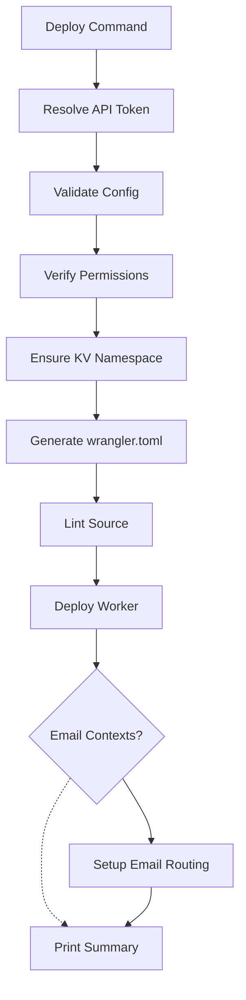

Deploy Reverse Proxy for ntfy to Cloudflare Workers and configure DNS, SSL, and custom domain routes.

## Cloudflare Requirements

- **Cloudflare account** — Free or paid. Workers are available on the free plan.
- **Registered domain** — You need a domain managed by Cloudflare DNS. Cloudflare Registrar offers domains at cost with no markup.
- **Wrangler authentication** — Run `wrangler login` to authenticate, or set the `CLOUDFLARE_API_TOKEN` environment variable in your `.env` file.

## How Deployment Works

The deploy command runs these steps in sequence:

1. **Resolve API token** — Reads `CLOUDFLARE_API_TOKEN` from `.env`. If missing or invalid, prompts interactively.
2. **Validate** — Checks config integrity (schema, server references, duplicate IDs).
3. **Verify permissions** — Confirms the API token has access to Workers Scripts, Workers Routes, Workers KV Storage, and (if email contexts exist) Email Routing Rules.
4. **Ensure KV namespace** — Creates or locates a Cloudflare Workers KV namespace for Statuspage deduplication. The namespace ID is automatically passed to the wrangler.toml generator.
5. **Generate** — Produces `wrangler.toml` from `config.json` with all routes, vars, and KV bindings.
6. **Lint** — Runs ESLint across the project source.
7. **Deploy worker** — Invokes `wrangler deploy` to push the worker to Cloudflare.
8. **Setup email routing** — If email contexts exist, automatically configures Cloudflare Email Routing rules to forward emails to the worker.
9. **Print summary** — Displays deployed context URLs and email addresses.

## Generated wrangler.toml

The generated file includes:

- **Routes** — Each HTTP context gets a custom domain route: `{context-id}.{base_domain}`. Cloudflare automatically creates DNS records for custom domain routes.
- **Email routing** — Comments showing which email addresses need to be configured in Cloudflare Email Routing for email contexts.
- **Environment variables** — `SETTINGS`, `SERVERS`, and `CONTEXTS` are injected as JSON strings.
- **KV namespace** — Bound if a KV namespace ID is provided (used by the Statuspage interpreter for deduplication).

:::warning
`wrangler.toml` is gitignored because it contains serialized config values. Do not commit it to version control.
:::

## DNS and SSL

After deployment:

- Cloudflare automatically creates DNS records for custom domain routes. Propagation typically takes a few minutes.
- SSL certificates are provisioned automatically by Cloudflare. This can take up to 15 minutes.
- Your SSL/TLS mode should be set to "Full" or "Full (strict)" in the Cloudflare dashboard.

## Custom Domain Routes

Routes use `custom_domain = true`, meaning the subdomain is the first part of the hostname. Traditional Cloudflare routes (with `custom_domain = false`) are not supported because the worker matches the hostname's subdomain against context IDs.

## Configuring Your ntfy Servers

For the proxy to work correctly, each ntfy server should have:

- `base-url` set to the server's public URL
- `behind-proxy` set to `true`
- `attachment-cache-dir` configured if you plan to receive binary attachments (images, files). Without this, ntfy cannot store uploaded files.

The proxy automatically splits messages exceeding 4000 UTF-8 bytes into numbered parts. This is handled by the proxy, not the ntfy server.

:::tip
ntfy's default attachment limits are: 15 MB per file (`attachment-file-size-limit`), 5 GB total storage (`attachment-total-size-limit`), and 3-hour expiry (`attachment-expiry-duration`). Adjust these based on your storage capacity and retention needs. Refer to the [ntfy self-hosting documentation](https://docs.ntfy.sh/config/) for full configuration options.
:::
