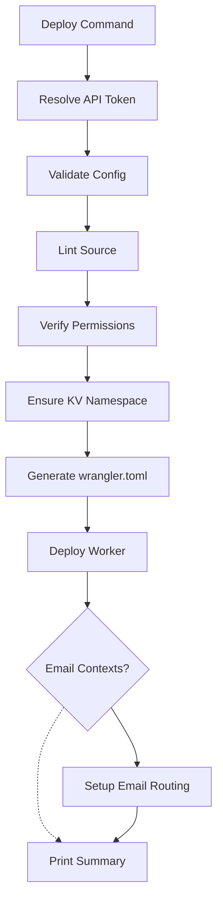

import { Terminology } from '@cbnventures/docusaurus-preset-nova/blocks';

Deploy Reverse Proxy for ntfy to Cloudflare Workers and configure DNS, SSL, and <Terminology title="Workers route treating the hostname's first label as subdomain" to="/docs/reference/terminology#custom-domain-route">custom domain routes</Terminology>.

## Cloudflare Requirements

- **Cloudflare account** — Free or paid. Workers are available on the free plan.
- **Registered domain** — You need a domain managed by Cloudflare DNS. Cloudflare Registrar offers domains at cost with no markup.
- **Wrangler authentication** — Run `wrangler login` to authenticate with Wrangler (Cloudflare's deployment CLI), or set the `CLOUDFLARE_API_TOKEN` environment variable in your `.env` file.

## How Deployment Works

The deploy command runs these steps in sequence:

```mermaid
flowchart TD
    Start[Deploy Command] --> ResolveToken[Resolve API Token]
    ResolveToken --> Validate[Validate Config]
    Validate --> Lint[Lint Source]
    Lint --> Verify[Verify Permissions]
    Verify --> KV[Ensure KV Namespace]
    KV --> Generate[Generate wrangler.toml]
    Generate --> DeployWorker[Deploy Worker]
    DeployWorker --> EmailCheck{Email Contexts?}
    EmailCheck --> SetupEmail[Setup Email Routing]
    EmailCheck -.-> Summary
    SetupEmail --> Summary[Print Summary]
```

1. **Resolve API token** — Reads `CLOUDFLARE_API_TOKEN` from `.env`. If missing or invalid, prompts interactively.
2. **Validate** — Checks config integrity (schema, <Terminology title="an ntfy instance defined by name, URL, and token" to="/docs/reference/terminology#server">server</Terminology> references, duplicate IDs).
3. **Lint** — Runs ESLint across the project source.
4. **Verify permissions** — Confirms the API token has access to Workers Scripts, Workers Routes, Workers KV Storage, and (if email <Terminology title="a notification source configuration" to="/docs/reference/terminology#context">contexts</Terminology> exist) Email Routing Rules.
5. **Ensure <Terminology title="Cloudflare Workers KV store for dedup state" to="/docs/reference/terminology#kv-namespace">KV namespace</Terminology>** — Creates or locates a Cloudflare Workers <Terminology title="Cloudflare Workers KV store for dedup state" to="/docs/reference/terminology#kv-namespace">KV namespace</Terminology> for Statuspage deduplication. The namespace ID is automatically passed to the <Terminology title="Cloudflare Workers config file generated from config.json" to="/docs/reference/terminology#wranglertoml">wrangler.toml</Terminology> generator.
6. **Generate** — Produces `wrangler.toml` from `config.json` with all routes, vars, and KV bindings.
7. **Deploy <Terminology title="Cloudflare-hosted entry point that runs the pipeline" to="/docs/reference/terminology#worker">worker</Terminology>** — Invokes `wrangler deploy` to push the <Terminology title="Cloudflare-hosted entry point that runs the pipeline" to="/docs/reference/terminology#worker">worker</Terminology> to Cloudflare.
8. **Setup email routing** — If email <Terminology title="a notification source configuration" to="/docs/reference/terminology#context">contexts</Terminology> exist, automatically configures <Terminology title="Cloudflare feature that forwards email to the Worker" to="/docs/reference/terminology#cloudflare-email-routing">Cloudflare Email Routing</Terminology> rules to forward emails to the <Terminology title="Cloudflare-hosted entry point that runs the pipeline" to="/docs/reference/terminology#worker">worker</Terminology>.
9. **Print summary** — Displays deployed <Terminology title="a notification source configuration" to="/docs/reference/terminology#context">context</Terminology> URLs and email addresses.

## Generated wrangler.toml

The generated file includes:

- **Routes** — Each HTTP <Terminology title="a notification source configuration" to="/docs/reference/terminology#context">context</Terminology> gets a <Terminology title="Workers route treating the hostname's first label as subdomain" to="/docs/reference/terminology#custom-domain-route">custom domain route</Terminology>: `{context-id}.{base_domain}`. Cloudflare automatically creates DNS records for <Terminology title="Workers route treating the hostname's first label as subdomain" to="/docs/reference/terminology#custom-domain-route">custom domain routes</Terminology>.
- **Email routing** — Comments showing which email addresses need to be configured in <Terminology title="Cloudflare feature that forwards email to the Worker" to="/docs/reference/terminology#cloudflare-email-routing">Cloudflare Email Routing</Terminology> for email <Terminology title="a notification source configuration" to="/docs/reference/terminology#context">contexts</Terminology>.
- **Environment variables** — `SETTINGS`, `SERVERS`, and `CONTEXTS` are injected as JSON strings.
- **<Terminology title="Cloudflare Workers KV store for dedup state" to="/docs/reference/terminology#kv-namespace">KV namespace</Terminology>** — Bound if a <Terminology title="Cloudflare Workers KV store for dedup state" to="/docs/reference/terminology#kv-namespace">KV namespace</Terminology> ID is provided (used by the Statuspage <Terminology title="module that transforms a payload into a notification" to="/docs/reference/terminology#interpreter">interpreter</Terminology> for deduplication).

:::warning
`wrangler.toml` is gitignored because it contains serialized config values. Do not commit it to version control.
:::

## DNS and SSL

After deployment:

- Cloudflare automatically creates DNS records for <Terminology title="Workers route treating the hostname's first label as subdomain" to="/docs/reference/terminology#custom-domain-route">custom domain routes</Terminology>. Propagation typically takes a few minutes.
- SSL certificates are provisioned automatically by Cloudflare. This can take up to 15 minutes.
- Your SSL/TLS mode should be set to "Full" or "Full (strict)" in the Cloudflare dashboard.

## Custom Domain Routes

Routes use `custom_domain = true`, meaning the subdomain is the first part of the hostname. Traditional Cloudflare routes (with `custom_domain = false`) are not supported because the <Terminology title="Cloudflare-hosted entry point that runs the pipeline" to="/docs/reference/terminology#worker">worker</Terminology> matches the hostname's subdomain against <Terminology title="a notification source configuration" to="/docs/reference/terminology#context">context</Terminology> IDs.

## Configuring Your ntfy Servers

For the proxy to work correctly, each ntfy <Terminology title="an ntfy instance defined by name, URL, and token" to="/docs/reference/terminology#server">server</Terminology> should have:

- `base-url` set to the <Terminology title="an ntfy instance defined by name, URL, and token" to="/docs/reference/terminology#server">server</Terminology>'s public URL
- `behind-proxy` set to `true`
- `attachment-cache-dir` configured if you plan to receive binary attachments (images, files). Without this, ntfy cannot store uploaded files.

The proxy automatically splits messages exceeding 4000 UTF-8 bytes into <Terminology title="splits message bodies over 4000 UTF-8 bytes into parts" to="/docs/reference/terminology#smart-split">numbered parts</Terminology>. This is handled by the proxy, not the ntfy <Terminology title="an ntfy instance defined by name, URL, and token" to="/docs/reference/terminology#server">server</Terminology>.

:::tip
ntfy's default attachment limits are: 15 MB per file (`attachment-file-size-limit`), 5 GB total storage (`attachment-total-size-limit`), and 3-hour expiry (`attachment-expiry-duration`). Adjust these based on your storage capacity and retention needs. Refer to the [ntfy self-hosting documentation](https://docs.ntfy.sh/config/) for full configuration options.
:::
