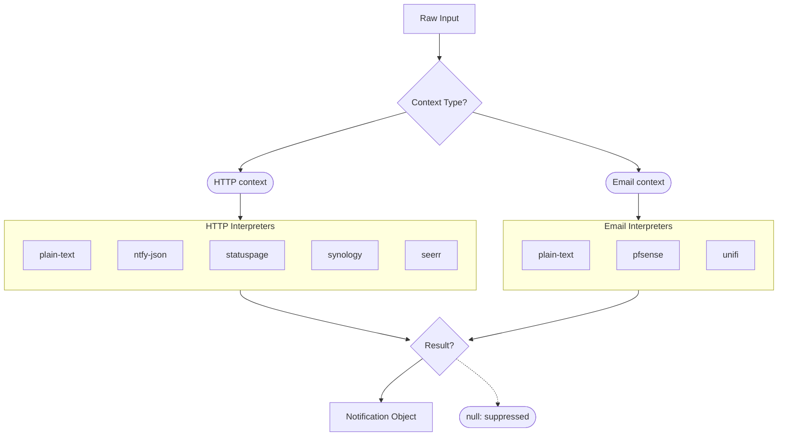

Learn how interpreters transform raw webhook payloads and email content into standardized ntfy notifications.

## How Interpreters Work

When a request or email arrives, the pipeline invokes the context's configured interpreter. The interpreter receives the raw input (string, JSON object, or binary) and returns a result with a `notification` object (title, body, priority, tags, icon, actions, markdown) and an optional `attachment` at the same level (not inside the notification). The `filename` field accompanies the attachment.

- If an interpreter returns `null`, the notification is suppressed (useful for filtering duplicate or irrelevant events).
- If interpretation fails, the pipeline returns HTTP 422 and optionally forwards the error to the context's `error_topic`.

HTML is automatically stripped from all notification bodies after interpretation.

## Available Interpreters

| Interpreter                                    | Input Type | Best For                                                   |
|------------------------------------------------|------------|------------------------------------------------------------|
| [`plain-text`](/docs/interpreters/plain-text/) | Any        | Generic webhooks, simple text notifications, testing       |
| [`ntfy-json`](/docs/interpreters/ntfy-json/)   | JSON       | Services that can send structured ntfy-compatible payloads |
| [`statuspage`](/docs/interpreters/statuspage/) | JSON       | Statuspage.io incident and component update webhooks       |
| [`synology`](/docs/interpreters/synology/)     | JSON       | Synology DSM webhook notifications                         |
| [`seerr`](/docs/interpreters/seerr/)           | JSON       | Seerr media request and issue notifications                |
| [`pfsense`](/docs/interpreters/pfsense/)       | Email      | pfSense firewall notification emails                       |
| [`unifi`](/docs/interpreters/unifi/)           | Email      | UniFi Network controller notification emails               |

## Choosing an Interpreter

- For services that send raw text or unstructured payloads, use `plain-text`.
- For services where you control the payload format, use `ntfy-json` to send pre-formatted notifications with full control over title, priority, tags, and other fields.
- For the specific services listed above, use the dedicated interpreter to get formatted titles, priority inference, and contextual tags.
- If you need email-to-ntfy forwarding from pfSense or UniFi, use their respective interpreters with an email context.

:::tip
If your webhook does not perfectly match the expected shape, try the dedicated interpreter first — most have lenient parsing. If it fails with 422, fall back to `plain-text` to see the raw payload, then consider `ntfy-json` if you can normalize the format on the source side.
:::

## Notification Suppression

Most interpreters always return a notification. The `statuspage` interpreter is the exception — it returns `null` (suppressing the notification) for:

- Component-only updates without an incident
- Duplicate incident updates detected via KV deduplication

See [Statuspage](/docs/interpreters/statuspage/) for details.

## Interpreter Availability by Context Type

The interactive CLI menu filters the interpreter list based on context type:

- **HTTP contexts** — `plain-text`, `ntfy-json`, `seerr`, `synology`, `statuspage`
- **Email contexts** — `plain-text`, `pfsense`, `unifi`

:::info
The config schema allows any of the 7 interpreters for either type, so you can assign any interpreter to any context via direct config editing.
:::
