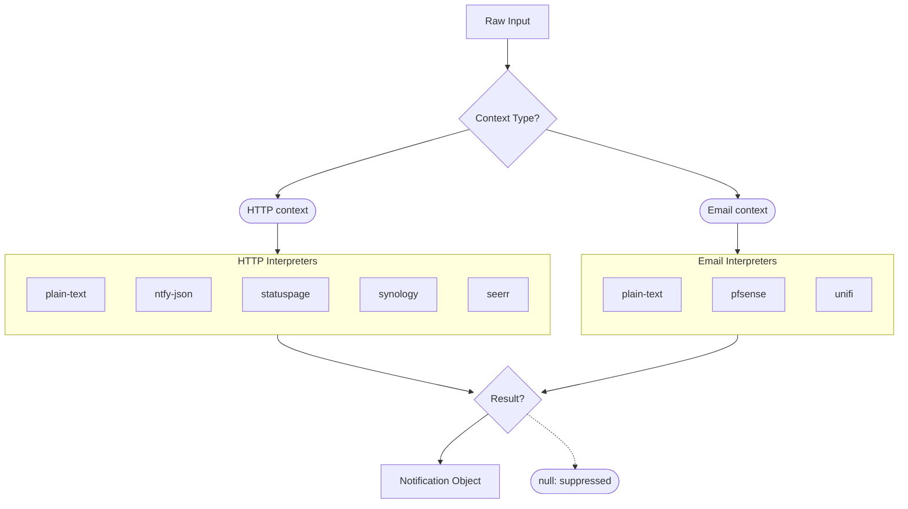

import { Terminology } from '@cbnventures/docusaurus-preset-nova/blocks';

<Terminology title="module that transforms a payload into a notification" to="/docs/reference/terminology#interpreter">Interpreters</Terminology> transform raw webhook payloads and email content into standardized ntfy notifications.

```mermaid
flowchart TD
    Input[Raw Input] --> Detect{Context Type?}

    Detect --> HTTP(["HTTP context"]):::muted
    Detect --> Email(["Email context"]):::muted

    subgraph HTTPInterpreters [HTTP Interpreters]
        direction TB
        PlainText1[plain-text]
        NtfyJson[ntfy-json]
        Statuspage[statuspage]
        Synology[synology]
        Seerr[seerr]
    end

    subgraph EmailInterpreters [Email Interpreters]
        direction TB
        PlainText2[plain-text]
        PfSense[pfsense]
        UniFi[unifi]
    end

    HTTP --> HTTPInterpreters
    Email --> EmailInterpreters

    HTTPInterpreters --> Result{Result?}
    EmailInterpreters --> Result

    Result --> Notification[Notification Object]
    Result -.-> Suppressed(["null: suppressed"]):::muted
```

## How Interpreters Work

When a request or email arrives, the <Terminology title="ordered stages a request passes through" to="/docs/reference/terminology#pipeline">pipeline</Terminology> invokes the <Terminology title="a notification source configuration" to="/docs/reference/terminology#context">context</Terminology>'s configured <Terminology title="module that transforms a payload into a notification" to="/docs/reference/terminology#interpreter">interpreter</Terminology>. The <Terminology title="module that transforms a payload into a notification" to="/docs/reference/terminology#interpreter">interpreter</Terminology> receives the raw input (string, JSON object, or binary) and returns a result with a `notification` object (title, body, priority, tags, icon, actions, markdown) and an optional `attachment` at the same level (not inside the notification).

The `filename` field accompanies the <Terminology title="a binary file delivered alongside a notification" to="/docs/reference/terminology#attachment">attachment</Terminology>.

- If an <Terminology title="module that transforms a payload into a notification" to="/docs/reference/terminology#interpreter">interpreter</Terminology> returns `null`, the notification is suppressed (useful for filtering duplicate or irrelevant events).
- If interpretation fails, the <Terminology title="ordered stages a request passes through" to="/docs/reference/terminology#pipeline">pipeline</Terminology> returns HTTP 422 and optionally forwards the error to the <Terminology title="a notification source configuration" to="/docs/reference/terminology#context">context</Terminology>'s `error_topic`.

HTML is automatically stripped from all notification bodies after interpretation.

## Available Interpreters

| Interpreter                                    | Input Type | Best For                                                   |
|------------------------------------------------|------------|------------------------------------------------------------|
| [`plain-text`](/docs/interpreters/plain-text/) | Any        | Generic webhooks, simple text notifications, testing       |
| [`ntfy-json`](/docs/interpreters/ntfy-json/)   | JSON       | Services that can send structured ntfy-compatible payloads |
| [`statuspage`](/docs/interpreters/statuspage/) | JSON       | Statuspage.io incident and component update webhooks       |
| [`synology`](/docs/interpreters/synology/)     | JSON       | Synology DSM webhook notifications                         |
| [`seerr`](/docs/interpreters/seerr/)           | JSON       | Seerr media request and issue notifications                |
| [`pfsense`](/docs/interpreters/pfsense/)       | Email      | pfSense firewall notification emails                       |
| [`unifi`](/docs/interpreters/unifi/)           | Email      | UniFi Network controller notification emails               |

## Choosing an Interpreter

- For services that send raw text or unstructured payloads, use `plain-text`.
- For services where you control the payload format, use `ntfy-json` to send pre-formatted notifications with full control over title, priority, tags, and other fields.
- For the specific services listed above, use the dedicated <Terminology title="module that transforms a payload into a notification" to="/docs/reference/terminology#interpreter">interpreter</Terminology> to get formatted titles, priority inference, and contextual tags.
- If you need email-to-ntfy forwarding from pfSense or UniFi, use their respective <Terminology title="module that transforms a payload into a notification" to="/docs/reference/terminology#interpreter">interpreters</Terminology> with an email <Terminology title="a notification source configuration" to="/docs/reference/terminology#context">context</Terminology>.

:::tip
If your webhook does not perfectly match the expected shape, try the dedicated <Terminology title="module that transforms a payload into a notification" to="/docs/reference/terminology#interpreter">interpreter</Terminology> first — most have lenient parsing. If it fails with 422, fall back to `plain-text` to see the raw payload, then consider `ntfy-json` if you can normalize the format on the source side.
:::

## Notification Suppression

Most <Terminology title="module that transforms a payload into a notification" to="/docs/reference/terminology#interpreter">interpreters</Terminology> always return a notification. The `statuspage` <Terminology title="module that transforms a payload into a notification" to="/docs/reference/terminology#interpreter">interpreter</Terminology> is the exception — it returns `null` (suppressing the notification) for:

- Component-only updates without an incident
- Duplicate incident updates detected via KV deduplication

See [Statuspage](/docs/interpreters/statuspage/) for details.

## Interpreter Availability by Context Type

The interactive CLI menu filters the <Terminology title="module that transforms a payload into a notification" to="/docs/reference/terminology#interpreter">interpreter</Terminology> list based on <Terminology title="a notification source configuration" to="/docs/reference/terminology#context">context</Terminology> type:

- **HTTP <Terminology title="a notification source configuration" to="/docs/reference/terminology#context">contexts</Terminology>** — `plain-text`, `ntfy-json`, `seerr`, `synology`, `statuspage`
- **Email <Terminology title="a notification source configuration" to="/docs/reference/terminology#context">contexts</Terminology>** — `plain-text`, `pfsense`, `unifi`

:::info
The config schema allows any of the 7 <Terminology title="module that transforms a payload into a notification" to="/docs/reference/terminology#interpreter">interpreters</Terminology> for either type, so you can assign any <Terminology title="module that transforms a payload into a notification" to="/docs/reference/terminology#interpreter">interpreter</Terminology> to any <Terminology title="a notification source configuration" to="/docs/reference/terminology#context">context</Terminology> via direct config editing.
:::
