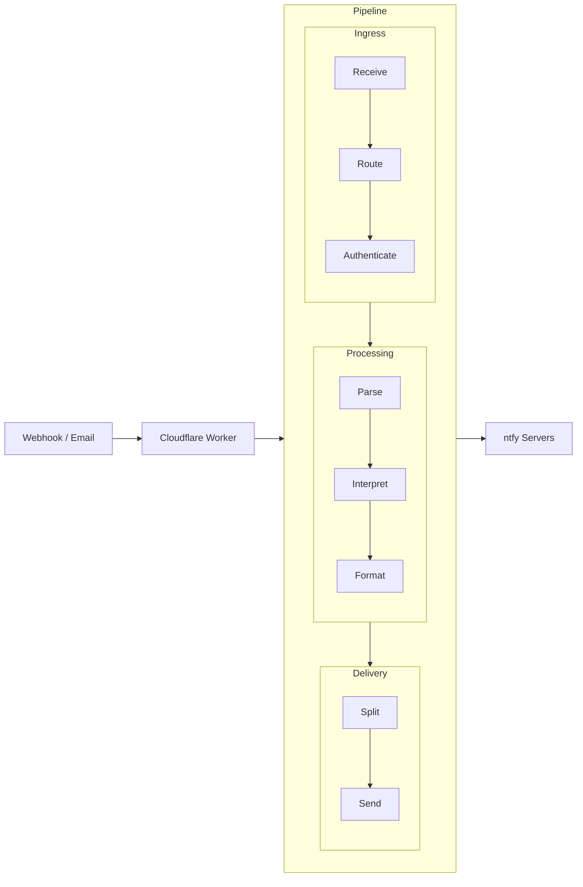

Learn what **Reverse Proxy for ntfy** does, how it fits into your notification stack, and where to go next.

## What Is This?

**Reverse Proxy for ntfy** is a Cloudflare Worker that sits between webhook sources and your self-hosted [ntfy](https://ntfy.sh) servers. It receives HTTP webhooks and emails, transforms them with purpose-built interpreters, and delivers formatted push notifications to one or more ntfy instances.

## Key Capabilities

- **Webhook-to-ntfy routing** — Accepts POST/PUT requests at context-specific subdomains and forwards them as ntfy notifications.
- **Email-to-ntfy routing** — Receives emails via Cloudflare Email Routing and converts them into push notifications.
- **Built-in interpreters** — Dedicated parsers for Statuspage.io, Synology DSM, Seerr, pfSense, and UniFi, plus generic plain-text and ntfy-JSON modes.
- **Server failover** — Supports `send-once` (primary with fallback) and `send-all` (broadcast to every server) delivery modes.
- **Interactive CLI** — Manages configuration, validates settings, generates `wrangler.toml`, and deploys to Cloudflare in one step.
- **Edge security** — Origin IP shielding, per-context token authentication, sender filtering for email, and automatic HTTPS enforcement.

## How It Works

Each notification source maps to a **context**. Contexts define the interpreter, delivery mode, topic, and server list. The CLI manages all of this through an interactive menu or direct commands.

## What You Will Need

- **Node.js** — v22 or v24 (LTS recommended)
- **npm** — v10 or later
- **Cloudflare account** — Free or paid, with a registered domain
- **ntfy server** — At least one self-hosted instance with token authentication enabled

## Next Steps

- **[Quick Start](/docs/getting-started/quick-start/)** — Install, configure, and send your first notification.
- **[Configuration](/docs/getting-started/configuration/)** — Full reference for servers, contexts, and settings.
- **[Interpreters](/docs/interpreters/overview/)** — Choose the right interpreter for your webhook source.
- **[Deployment](/docs/getting-started/deployment/)** — Cloudflare-specific setup details.
- **[Architecture](/docs/reference/architecture/)** — Understand the HTTP and email processing pipelines.
