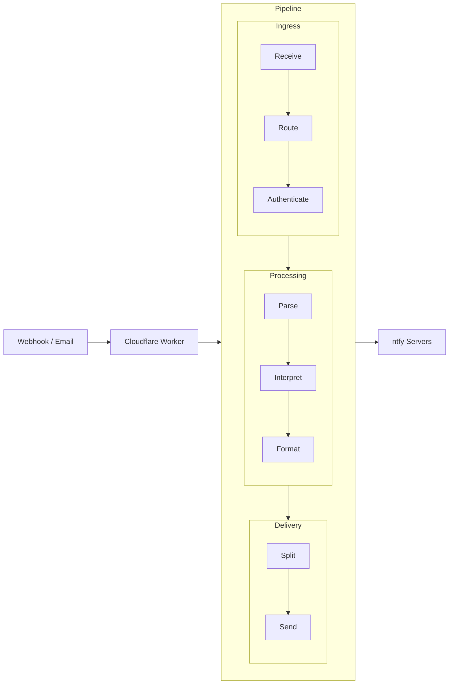

import { Terminology } from '@cbnventures/docusaurus-preset-nova/blocks';

**Reverse Proxy for ntfy** receives webhooks and emails at the edge, transforms them with purpose-built <Terminology title="module that transforms a payload into a notification" to="/docs/reference/terminology#interpreter">interpreters</Terminology>, and delivers formatted push notifications to self-hosted ntfy <Terminology title="an ntfy instance defined by name, URL, and token" to="/docs/reference/terminology#server">servers</Terminology>.

## What Is This?

**Reverse Proxy for ntfy** is a Cloudflare <Terminology title="Cloudflare-hosted entry point that runs the pipeline" to="/docs/reference/terminology#worker">Worker</Terminology> that sits between webhook sources and your self-hosted [ntfy](https://ntfy.sh) <Terminology title="an ntfy instance defined by name, URL, and token" to="/docs/reference/terminology#server">servers</Terminology>. It receives HTTP webhooks and emails, transforms them with purpose-built <Terminology title="module that transforms a payload into a notification" to="/docs/reference/terminology#interpreter">interpreters</Terminology>, and delivers formatted push notifications to one or more ntfy instances.

## Key Capabilities

- **Webhook-to-ntfy routing** — Accepts POST/PUT requests at <Terminology title="a notification source configuration" to="/docs/reference/terminology#context">context</Terminology>-specific subdomains and forwards them as ntfy notifications.
- **Email-to-ntfy routing** — Receives emails via <Terminology title="Cloudflare feature that forwards email to the Worker" to="/docs/reference/terminology#cloudflare-email-routing">Cloudflare Email Routing</Terminology> and converts them into push notifications.
- **Built-in <Terminology title="module that transforms a payload into a notification" to="/docs/reference/terminology#interpreter">interpreters</Terminology>** — Dedicated parsers for Statuspage.io, Synology DSM, Seerr, pfSense, and UniFi, plus generic plain-text and ntfy-JSON modes.
- **<Terminology title="an ntfy instance defined by name, URL, and token" to="/docs/reference/terminology#server">Server</Terminology> failover** — Supports `send-once` (primary with fallback) and `send-all` (broadcast to every <Terminology title="an ntfy instance defined by name, URL, and token" to="/docs/reference/terminology#server">server</Terminology>) delivery modes.
- **Interactive CLI** — Manages configuration, validates settings, generates `wrangler.toml`, and deploys to Cloudflare in one step.
- **Edge security** — Origin IP shielding, per-<Terminology title="a notification source configuration" to="/docs/reference/terminology#context">context</Terminology> token authentication, sender filtering for email, and automatic HTTPS enforcement.

## How It Works

```mermaid
flowchart LR
    Source[Webhook / Email] --> Worker[Cloudflare Worker]
    Worker --> Pipeline
    Pipeline --> ntfy[ntfy Servers]

    subgraph Pipeline [Pipeline]
        direction TB

        subgraph Ingress [Ingress]
            direction TB
            Receive --> Route
            Route --> Authenticate
        end

        subgraph Processing [Processing]
            direction TB
            Parse --> Interpret
            Interpret --> Format
        end

        subgraph Delivery [Delivery]
            direction TB
            Split --> Send
        end

        Ingress --> Processing --> Delivery
    end
```

Each notification source maps to a **<Terminology title="a notification source configuration" to="/docs/reference/terminology#context">context</Terminology>**. <Terminology title="a notification source configuration" to="/docs/reference/terminology#context">Contexts</Terminology> define the <Terminology title="module that transforms a payload into a notification" to="/docs/reference/terminology#interpreter">interpreter</Terminology>, delivery mode, <Terminology title="the ntfy channel a context publishes notifications to" to="/docs/reference/terminology#topic">topic</Terminology>, and <Terminology title="an ntfy instance defined by name, URL, and token" to="/docs/reference/terminology#server">server</Terminology> list.

The CLI manages all of this through an interactive menu or direct commands.

## What You Will Need

- **Node.js** — v22 or v24 (LTS recommended)
- **npm** — v10 or later
- **Cloudflare account** — Free or paid, with a registered domain
- **ntfy <Terminology title="an ntfy instance defined by name, URL, and token" to="/docs/reference/terminology#server">server</Terminology>** — At least one self-hosted instance with token authentication enabled

## Next Steps

- **[Quick Start](/docs/getting-started/quick-start/)** — Install, configure, and send your first notification.
- **[Configuration](/docs/getting-started/configuration/)** — Full reference for <Terminology title="an ntfy instance defined by name, URL, and token" to="/docs/reference/terminology#server">servers</Terminology>, <Terminology title="a notification source configuration" to="/docs/reference/terminology#context">contexts</Terminology>, and settings.
- **[Interpreters](/docs/interpreters/overview/)** — Choose the right <Terminology title="module that transforms a payload into a notification" to="/docs/reference/terminology#interpreter">interpreter</Terminology> for your webhook source.
- **[Deployment](/docs/getting-started/deployment/)** — Cloudflare-specific setup details.
- **[Architecture](/docs/reference/architecture/)** — Understand the HTTP and email processing <Terminology title="ordered stages a request passes through" to="/docs/reference/terminology#pipeline">pipelines</Terminology>.
