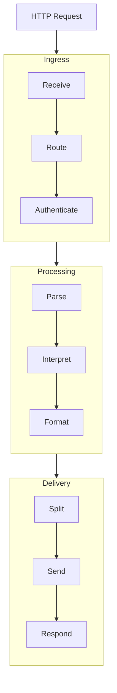
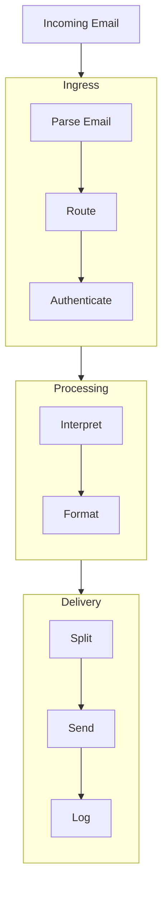
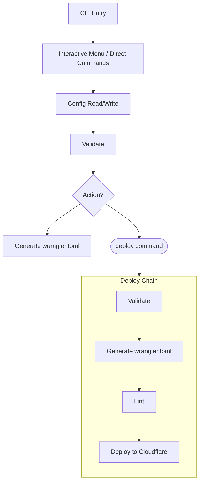

Understand the two entry points, processing pipelines, error strategy, and source structure of Reverse Proxy for ntfy.

## Overview

Reverse Proxy for ntfy has two entry points running on different runtimes:

- **Cloudflare Worker** — Handles incoming HTTP webhooks and email messages. Runs on Cloudflare's edge network.
- **Node.js CLI** — Manages the configuration file. Runs locally on your machine.

The worker and CLI are cleanly separated. The CLI writes `config.json`, and the worker reads it (injected as environment variables at deploy time).

## HTTP Pipeline

The worker processes HTTP requests through a linear 9-stage pipeline. Each stage transforms data and passes it to the next. If any stage fails, the pipeline stops and returns an error response.



### Stage Details

**Receive** — Extracts method, hostname, headers, and raw body from the incoming request. Redirects HTTP to HTTPS automatically (except on localhost).

- Rejects methods other than GET, POST, and PUT.
- GET requests skip the pipeline and return the landing page.

**Route** — Matches the request's subdomain against configured HTTP contexts. Resolves the context's server list and primary server.

- Returns 404 if no matching context is found.

**Authenticate** — Validates the `Authorization` header against the context's optional token. If the context has no token configured, all requests are allowed.

- Returns 403 on failure.
- Optionally forwards error details to the `error_topic` if configured.

**Parse** — Classifies the request body as JSON, text, or binary. Detects binary content via content-type headers or null byte scanning.

- Attempts JSON parsing if the content-type is `application/json` or the body starts with `{` or `[`.

**Interpret** — Invokes the context's configured interpreter to transform the raw payload into a standardized notification object (title, body, priority, tags, icon, actions, etc.). HTML is automatically stripped from the notification body.

- Returns 422 if interpretation fails.
- Returns a null result if the interpreter intentionally ignores the payload, which produces an HTTP 200 with status `"ignored"`.

**Format** — Builds the final message body and ntfy headers (`X-Title`, `X-Priority`, `X-Tags`, `X-Markdown`, `X-Icon`, `X-Actions`, etc.). Appends visitor information (IP, location, ISP) if `show_visitor_info` is enabled.

**Split** — Splits messages exceeding 4000 UTF-8 bytes into numbered parts. Each part gets a title suffix like "(1/3)", "(2/3)", "(3/3)".

- Messages under the limit pass through as a single part.

**Send** — Delivers notification parts to ntfy servers according to the delivery mode.

- In `send-once` mode, tries the primary server first, then fallbacks in order.
- In `send-all` mode, sends to all servers in parallel.
- Handles attachments as a separate PUT request per server.

**Respond** — Builds the JSON response with a status of `"success"`, `"partial"`, or `"failed"`. Returns HTTP 200 if any server succeeded, 502 if all failed.

- Includes detailed debug output if `show_response_output` is enabled.

## Email Pipeline

The email pipeline processes messages from Cloudflare Email Routing through 8 stages.



**Parse Email** — Decodes the raw RFC 5322 email message. Extracts from, to, subject, and text body.

- Handles multipart/alternative MIME messages, preferring text/plain over HTML.

**Route** — Matches the recipient's local part (before the `@`) to a context ID.

**Authenticate** — Validates the sender address against the context's `allowed_from` field. Supports exact match and wildcard patterns (`*@domain.com`).

The remaining stages (Interpret, Format, Split, Send) work identically to the HTTP pipeline.

**Log** — Outputs a debug JSON log with context name, interpreter, server results, body size, and part count to Cloudflare's real-time logs.

- Email processing is silent — there is no HTTP response to return.
- Email routing failures (e.g., no matching context ID for the recipient address) are silent — no error notification is sent to `error_topic`.

## CLI Architecture



The CLI reads and writes `config.json` through a config I/O layer. All config mutations go through schema validation.

- The generate command produces a `wrangler.toml` file from the config.
- The deploy command chains validation, generation, linting, and deployment into a single step.

## Error Strategy

| Layer              | Strategy                                                                                                                                                                          |
|--------------------|-----------------------------------------------------------------------------------------------------------------------------------------------------------------------------------|
| Worker entry point | Try/catch around entire pipeline. Returns JSON with HTTP status. Includes debug details if `show_response_output` is on.                                                          |
| Pipeline stages    | Each stage returns a typed result or throws. The entry point identifies which stage failed.                                                                                       |
| Interpreters       | Manual payload extraction. The `ntfy-json` interpreter uses strict schema validation; all others use lenient field detection. Optionally forwards to `error_topic` if configured. |
| Send/fallback      | Never throws. Collects per-server results. Primary failure triggers fallback. Returns success/failure per server.                                                                 |
| CLI                | Try/catch at command level. Chalk-formatted errors. Non-zero exit code on failure.                                                                                                |
| Config validation  | Schema validation on load. Checks orphaned server refs, duplicate context IDs, missing fields, invalid token format.                                                              |

## Source Structure

```
src/
  worker/
    index.ts                — Worker entry point (fetch + email handlers)
    pipeline/
      receive.ts            — Extract request metadata
      route.ts              — Match subdomain/email to context
      authenticate.ts       — Validate tokens and sender addresses
      parse.ts              — Detect body type (text, JSON, binary)
      interpret.ts          — Dispatcher to interpreter modules
      accumulate.ts         — KV state management for Statuspage
      format.ts             — Build message body and ntfy headers
      split.ts              — Smart split for large messages
      email.ts              — RFC 5322 email parser
      send.ts               — Deliver to servers with fallback
      respond.ts            — Build HTTP response
    interpreters/
      plain-text.ts         — Pass-through text
      ntfy-json.ts          — ntfy JSON mapping
      synology.ts           — Synology DSM webhooks
      statuspage.ts         — Statuspage.io webhooks/emails
      seerr.ts              — Seerr media requests
      pfsense.ts            — pfSense email notifications
      unifi.ts              — UniFi email notifications
    landing/
      page.ts               — Landing page HTML
  cli/
    index.ts                — CLI entry point
    commands/
      server.ts             — Server CRUD
      context.ts            — Context CRUD
      settings.ts           — Settings management
      config-io.ts          — Config file read/write
      generate.ts           — wrangler.toml generation
      validate.ts           — Config validation
      deploy.ts             — Cloudflare deployment
    menu/
      interactive.ts        — Interactive TUI
  lib/
    item.ts                 — App name constant
    regex.ts                — Shared regex patterns
    schema.ts               — Zod schemas
    utility.ts              — Helper functions (HTML stripping)
  types/                    — TypeScript type definitions (mirrors src/)
```
