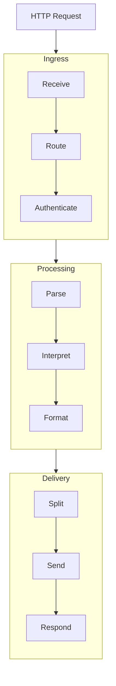
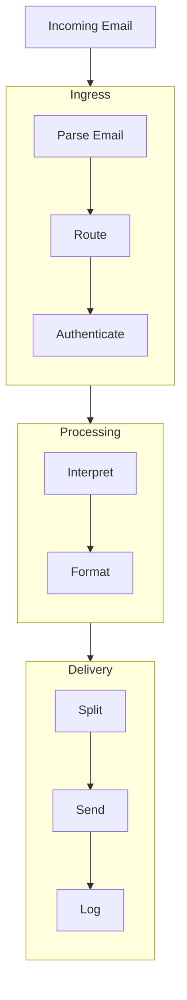
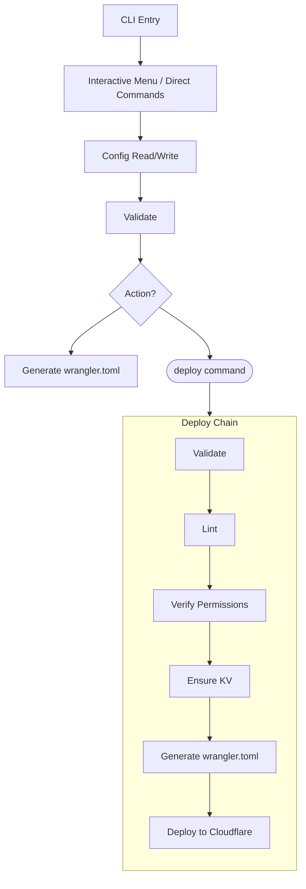

import { Terminology } from '@cbnventures/docusaurus-preset-nova/blocks';

Understand the two entry points, processing <Terminology title="ordered stages a request passes through" to="/docs/reference/terminology#pipeline">pipelines</Terminology>, error strategy, and source structure of Reverse Proxy for ntfy.

## Overview

Reverse Proxy for ntfy has two entry points running on different runtimes:

- **Cloudflare <Terminology title="Cloudflare-hosted entry point that runs the pipeline" to="/docs/reference/terminology#worker">Worker</Terminology>** — Handles incoming HTTP webhooks and email messages. Runs on Cloudflare's edge network.
- **Node.js CLI** — Manages the configuration file. Runs locally on your machine.

The <Terminology title="Cloudflare-hosted entry point that runs the pipeline" to="/docs/reference/terminology#worker">worker</Terminology> and CLI are cleanly separated. The CLI writes `config.json`, and the <Terminology title="Cloudflare-hosted entry point that runs the pipeline" to="/docs/reference/terminology#worker">worker</Terminology> reads it (injected as environment variables at deploy time).

## HTTP Pipeline

The <Terminology title="Cloudflare-hosted entry point that runs the pipeline" to="/docs/reference/terminology#worker">worker</Terminology> processes HTTP requests through a linear 9-stage <Terminology title="ordered stages a request passes through" to="/docs/reference/terminology#pipeline">pipeline</Terminology>. Each stage transforms data and passes it to the next.

If any stage fails, the <Terminology title="ordered stages a request passes through" to="/docs/reference/terminology#pipeline">pipeline</Terminology> stops and returns an error response.


```mermaid
graph TD
    Request[HTTP Request] --> Ingress
    Ingress --> Processing
    Processing --> Delivery

    subgraph Ingress [Ingress]
        direction TB
        Receive --> Route
        Route --> Authenticate
    end

    subgraph Processing [Processing]
        direction TB
        Parse --> Interpret
        Interpret --> Format
    end

    subgraph Delivery [Delivery]
        direction TB
        Split --> Send
        Send --> Respond
    end
```

### Stage Details

**Receive** — Extracts method, hostname, headers, and raw body from the incoming request. Redirects HTTP to HTTPS automatically (except on localhost).

- Rejects methods other than GET, POST, and PUT.
- GET requests skip the <Terminology title="ordered stages a request passes through" to="/docs/reference/terminology#pipeline">pipeline</Terminology> and return the <Terminology title="HTML status page returned on GET requests" to="/docs/reference/terminology#landing-page">landing page</Terminology>.

**Route** — Matches the request's subdomain against configured HTTP <Terminology title="a notification source configuration" to="/docs/reference/terminology#context">contexts</Terminology>. Resolves the <Terminology title="a notification source configuration" to="/docs/reference/terminology#context">context</Terminology>'s <Terminology title="an ntfy instance defined by name, URL, and token" to="/docs/reference/terminology#server">server</Terminology> list and <Terminology title="preferred ntfy server, tried first" to="/docs/reference/terminology#primary-server">primary server</Terminology>.

- Returns 404 if no matching <Terminology title="a notification source configuration" to="/docs/reference/terminology#context">context</Terminology> is found.

**Authenticate** — Validates the `Authorization` header against the <Terminology title="a notification source configuration" to="/docs/reference/terminology#context">context</Terminology>'s optional token. If the <Terminology title="a notification source configuration" to="/docs/reference/terminology#context">context</Terminology> has no token configured, all requests are allowed.

- Returns 403 on failure.
- Optionally forwards error details to the `error_topic` if configured.

**Parse** — Classifies the request body as JSON, text, or binary. Detects binary content via content-type headers or null byte scanning.

- Attempts JSON parsing if the content-type is `application/json` or the body starts with `{` or `[`.

**Interpret** — Invokes the <Terminology title="a notification source configuration" to="/docs/reference/terminology#context">context</Terminology>'s configured <Terminology title="module that transforms a payload into a notification" to="/docs/reference/terminology#interpreter">interpreter</Terminology> to transform the raw payload into a standardized <Terminology title="standardized result an interpreter returns" to="/docs/reference/terminology#notification-object">notification object</Terminology> (title, body, priority, tags, icon, actions, etc.). HTML is automatically stripped from the notification body.

- Returns 422 if interpretation fails.
- Returns a null result if the <Terminology title="module that transforms a payload into a notification" to="/docs/reference/terminology#interpreter">interpreter</Terminology> intentionally ignores the payload, which produces an HTTP 200 with status `"ignored"`.

**Format** — Builds the final message body and <Terminology title="8 outgoing headers the proxy sets from the notification" to="/docs/reference/terminology#ntfy-headers">ntfy headers</Terminology> (`X-Title`, `X-Priority`, `X-Tags`, `X-Markdown`, `X-Icon`, `X-Actions`, etc.). Appends visitor information (IP, location, ISP) if `show_visitor_info` is enabled.

**Split** — Splits messages exceeding 4000 UTF-8 bytes into <Terminology title="splits message bodies over 4000 UTF-8 bytes into parts" to="/docs/reference/terminology#smart-split">numbered parts</Terminology>. Each part gets a title suffix like "(1/3)", "(2/3)", "(3/3)".

- Messages under the limit pass through as a single part.

**Send** — Delivers notification parts to ntfy <Terminology title="an ntfy instance defined by name, URL, and token" to="/docs/reference/terminology#server">servers</Terminology> according to the delivery mode.

- In `send-once` mode, tries the <Terminology title="preferred ntfy server, tried first" to="/docs/reference/terminology#primary-server">primary server</Terminology> first, then fallbacks in order.
- In `send-all` mode, sends to all <Terminology title="an ntfy instance defined by name, URL, and token" to="/docs/reference/terminology#server">servers</Terminology> in parallel.
- Handles <Terminology title="a binary file delivered alongside a notification" to="/docs/reference/terminology#attachment">attachments</Terminology> as a separate PUT request per <Terminology title="an ntfy instance defined by name, URL, and token" to="/docs/reference/terminology#server">server</Terminology>.

**Respond** — Builds the JSON response with a status of `"success"`, `"partial"`, or `"failed"`. Returns HTTP 200 if any <Terminology title="an ntfy instance defined by name, URL, and token" to="/docs/reference/terminology#server">server</Terminology> succeeded, 502 if all failed.

- Includes detailed <Terminology title="the show_response_output setting" to="/docs/reference/terminology#debug-mode">debug output</Terminology> if `show_response_output` is enabled.

## Email Pipeline

The email <Terminology title="ordered stages a request passes through" to="/docs/reference/terminology#pipeline">pipeline</Terminology> processes messages from <Terminology title="Cloudflare feature that forwards email to the Worker" to="/docs/reference/terminology#cloudflare-email-routing">Cloudflare Email Routing</Terminology> through 8 stages.


```mermaid
graph TD
    Email[Incoming Email] --> Ingress
    Ingress --> Processing
    Processing --> Delivery

    subgraph Ingress [Ingress]
        direction TB
        ParseEmail[Parse Email] --> Route
        Route --> Authenticate
    end

    subgraph Processing [Processing]
        direction TB
        Interpret --> Format
    end

    subgraph Delivery [Delivery]
        direction TB
        Split --> Send
        Send --> Log
    end
```

**Parse Email** — Decodes the raw RFC 5322 email message. Extracts from, to, subject, and text body.

- Handles multipart/alternative MIME messages, preferring text/plain over HTML.

**Route** — Matches the recipient's local part (before the `@`) to a <Terminology title="a notification source configuration" to="/docs/reference/terminology#context">context</Terminology> ID.

**Authenticate** — Validates the sender address against the <Terminology title="a notification source configuration" to="/docs/reference/terminology#context">context</Terminology>'s `allowed_from` field. Supports exact match and wildcard patterns (`*@domain.com`).

The remaining stages (Interpret, Format, Split, Send) work identically to the HTTP <Terminology title="ordered stages a request passes through" to="/docs/reference/terminology#pipeline">pipeline</Terminology>.

**Log** — Outputs a debug JSON log with <Terminology title="a notification source configuration" to="/docs/reference/terminology#context">context</Terminology> name, <Terminology title="module that transforms a payload into a notification" to="/docs/reference/terminology#interpreter">interpreter</Terminology>, <Terminology title="an ntfy instance defined by name, URL, and token" to="/docs/reference/terminology#server">server</Terminology> results, body size, and part count to Cloudflare's real-time logs.

- Email processing is silent — there is no HTTP response to return.
- Email routing failures (e.g., no matching <Terminology title="a notification source configuration" to="/docs/reference/terminology#context">context</Terminology> ID for the recipient address) are silent — no error notification is sent to `error_topic`.

## CLI Architecture


```mermaid
graph TD
    CLI[CLI Entry] --> Menu[Interactive Menu / Direct Commands]
    Menu --> ConfigIO[Config Read/Write]
    ConfigIO --> Validate

    Validate --> Action{Action?}
    Action --> Generate[Generate wrangler.toml]
    Action --> DeployCmd(["deploy command"]):::muted

    subgraph Deploy [Deploy Chain]
        direction TB
        DValidate[Validate] --> DLint[Lint]
        DLint --> DVerify[Verify Permissions]
        DVerify --> DKV[Ensure KV]
        DKV --> DGenerate[Generate wrangler.toml]
        DGenerate --> DDeploy[Deploy to Cloudflare]
    end

    DeployCmd --> Deploy
```

The CLI reads and writes `config.json` through a config I/O layer. All config mutations go through schema validation.

- The generate command produces a `wrangler.toml` file from the config.
- The deploy command chains validation, linting, permission verification, KV provisioning, <Terminology title="Cloudflare Workers config file generated from config.json" to="/docs/reference/terminology#wranglertoml">wrangler.toml</Terminology> generation, and deployment into a single step.

## Error Strategy

| Layer              | Strategy                                                                                                                                                                                                                                                                                                                                                                  |
|--------------------|---------------------------------------------------------------------------------------------------------------------------------------------------------------------------------------------------------------------------------------------------------------------------------------------------------------------------------------------------------------------------|
| Worker entry point | Try/catch around entire <Terminology title="ordered stages a request passes through" to="/docs/reference/terminology#pipeline">pipeline</Terminology>. Returns JSON with HTTP status. Includes <Terminology title="the show_response_output setting" to="/docs/reference/terminology#debug-mode">debug details</Terminology> if `show_response_output` is on.             |
| Pipeline stages    | Each stage returns a typed result or throws. The entry point identifies which stage failed.                                                                                                                                                                                                                                                                               |
| Interpreters       | Manual payload extraction. The `ntfy-json` <Terminology title="module that transforms a payload into a notification" to="/docs/reference/terminology#interpreter">interpreter</Terminology> uses strict schema validation; all others use lenient field detection. Optionally forwards to `error_topic` if configured.                                                    |
| Send/fallback      | Never throws. Collects per-<Terminology title="an ntfy instance defined by name, URL, and token" to="/docs/reference/terminology#server">server</Terminology> results. Primary failure triggers fallback. Returns success/failure per <Terminology title="an ntfy instance defined by name, URL, and token" to="/docs/reference/terminology#server">server</Terminology>. |
| CLI                | Try/catch at command level. Chalk-formatted errors. Non-zero exit code on failure.                                                                                                                                                                                                                                                                                        |
| Config validation  | Schema validation on load. Checks orphaned <Terminology title="an ntfy instance defined by name, URL, and token" to="/docs/reference/terminology#server">server</Terminology> refs, duplicate <Terminology title="a notification source configuration" to="/docs/reference/terminology#context">context</Terminology> IDs, missing fields, invalid token format.          |

## Source Structure

```text
src/
  worker/
    index.ts                — Worker entry point (fetch + email handlers)
    pipeline/
      receive.ts            — Extract request metadata
      route.ts              — Match subdomain/email to context
      authenticate.ts       — Validate tokens and sender addresses
      parse.ts              — Detect body type (text, JSON, binary)
      interpret.ts          — Dispatcher to interpreter modules
      accumulate.ts         — KV state management for Statuspage
      format.ts             — Build message body and ntfy headers
      split.ts              — Smart split for large messages
      email.ts              — RFC 5322 email parser
      send.ts               — Deliver to servers with fallback
      respond.ts            — Build HTTP response
    interpreters/
      plain-text.ts         — Pass-through text
      ntfy-json.ts          — ntfy JSON mapping
      synology.ts           — Synology DSM webhooks
      statuspage.ts         — Statuspage.io webhooks/emails
      seerr.ts              — Seerr media requests
      pfsense.ts            — pfSense email notifications
      unifi.ts              — UniFi email notifications
    landing/
      page.ts               — Landing page HTML
  cli/
    index.ts                — CLI entry point
    commands/
      server.ts             — Server CRUD
      context.ts            — Context CRUD
      settings.ts           — Settings management
      config-io.ts          — Config file read/write
      generate.ts           — wrangler.toml generation
      validate.ts           — Config validation
      deploy.ts             — Cloudflare deployment
    menu/
      interactive.ts        — Interactive TUI
  lib/
    item.ts                 — App name constant
    regex.ts                — Shared regex patterns
    schema.ts               — Zod schemas
    utility.ts              — Helper functions (HTML stripping)
  types/                    — TypeScript type definitions (mirrors src/)
```
